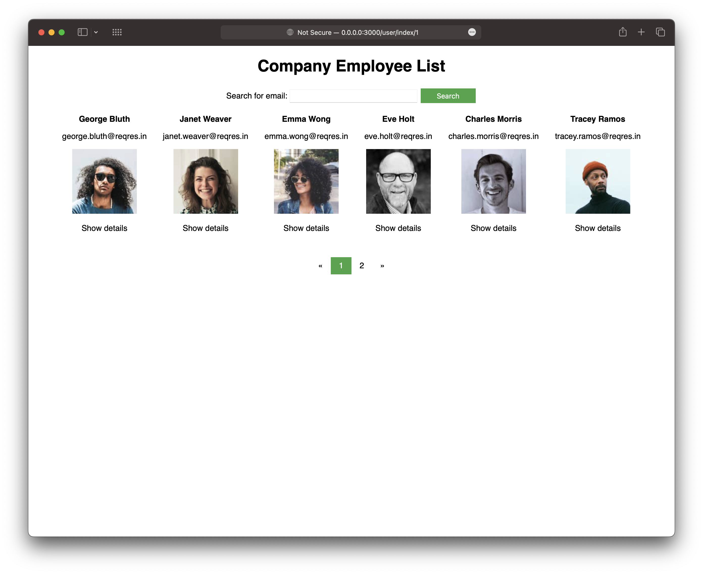
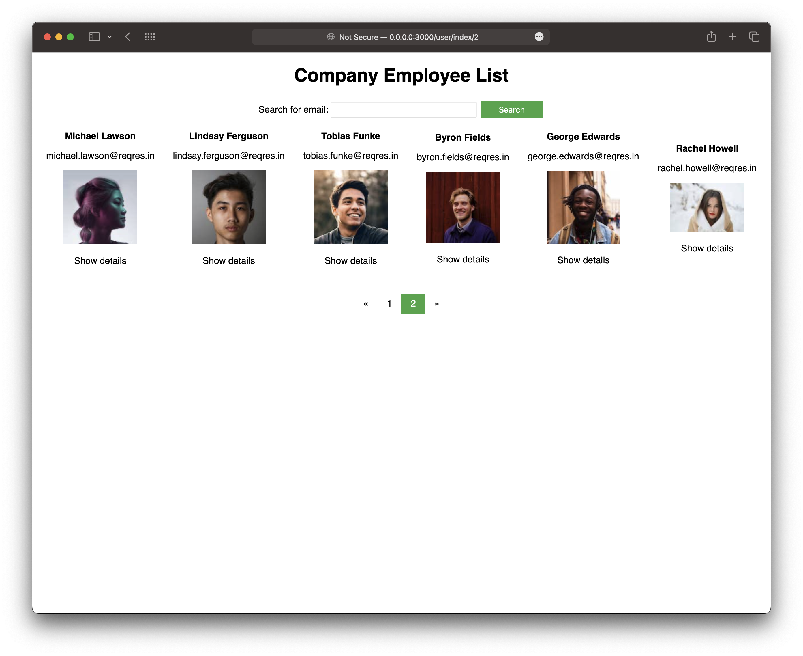
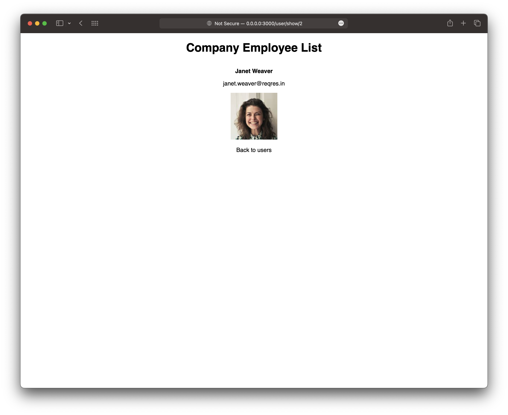
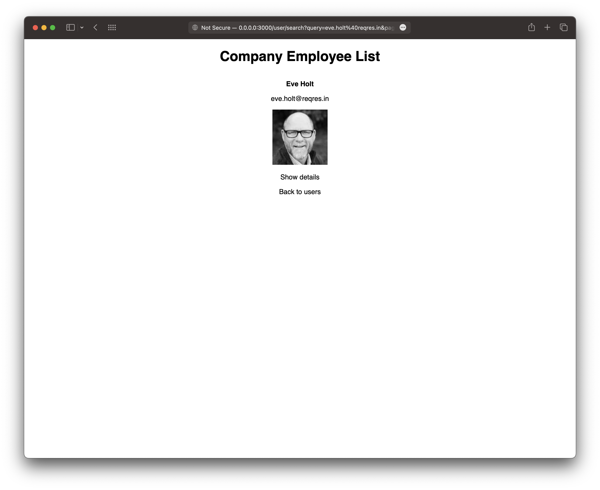

## Get data from an external RESTful JSON API With Rails

In this project, I will show how to pull employee information from an external RESTful JSON API with Ruby on Rails backend.

### Install
```bash
$ git clone git@github.com:o9uzdev/rails-get-data-from-external-restful-api.git
$ cd rails-get-data-from-external-restful-api
$ docker build -t rubyapp .
$ docker run -p 3000:3000 rubyapp
```

### Visit 

You can visit `0.0.0.0:3000`

### Screen Shoots

Users Screen #1

Users Screen #2

Users Show Screen

Users Search Screen

